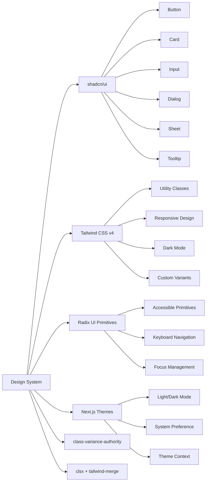
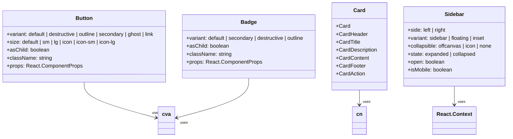

# Design System Architecture Diagram

## Component Hierarchy

```mermaid
graph TD
    A[Design System] --> B[Core UI Components]
    A --> C[Composite Components]
    A --> D[Domain-Specific Components]
    A --> E[Utilities & Helpers]
    
    B --> B1[Button]
    B --> B2[Card]
    B --> B3[Input]
    B --> B4[Badge]
    B --> B5[Separator]
    B --> B6[Skeleton]
    B --> B7[Tooltip]
    B --> B8[Dialog]
    B --> B9[Sheet]
    
    C --> C1[Sidebar System]
    C1 --> C1a[SidebarProvider]
    C1 --> C1b[Sidebar]
    C1 --> C1c[SidebarTrigger]
    C1 --> C1d[SidebarRail]
    C1 --> C1e[SidebarHeader]
    C1 --> C1f[SidebarFooter]
    C1 --> C1g[SidebarContent]
    C1 --> C1h[SidebarMenu]
    C1 --> C1i[SidebarMenuButton]
    C1 --> C1j[SidebarMenuAction]
    
    C --> C2[Step Indicator]
    C --> C3[Transcript Form]
    
    D --> D1[AnalysisPanel]
    D --> D2[SlidesPanel]
    D --> D3[SuperAnalysisPanel]
    D --> D4[ZoomDialog]
    
    E --> E1[cn() utility]
    E --> E2[cva() variants]
    E --> E3[ThemeProvider]
    E --> E4[useSidebar hook]
```

## Technology Stack



## Design Token Flow

```mermaid
graph TD
    A[CSS Custom Properties] --> B[Light Theme Tokens]
    A --> C[Dark Theme Tokens]
    
    B --> B1[--background: oklch(1 0 0)]
    B --> B2[--foreground: oklch(0.145 0 0)]
    B --> B3[--primary: oklch(0.205 0 0)]
    B --> B4[--secondary: oklch(0.97 0 0)]
    B --> B5[--destructive: oklch(0.577 0.245 27.325)]
    
    C --> C1[--background: oklch(0.145 0 0)]
    C --> C2[--foreground: oklch(0.985 0 0)]
    C --> C3[--primary: oklch(0.985 0 0)]
    C --> C4[--secondary: oklch(0.269 0 0)]
    C --> C5[--destructive: oklch(0.396 0.141 25.723)]
    
    A --> D[Theme Variables]
    D --> D1[var(--color-background)]
    D --> D2[var(--color-foreground)]
    D --> D3[var(--color-primary)]
    D --> D4[var(--color-secondary)]
    D --> D5[var(--color-destructive)]
    
    A --> E[Component Usage]
    E --> E1[Button variants]
    E --> E2[Card styling]
    E --> E3[Input states]
    E --> E4[Badge colors]
```

## Component Variant System



## Development Workflow

```mermaid
flowchart TD
    A[Component Request] --> B[Design Review]
    B --> C[Create Component]
    C --> D[Add to UI Library]
    D --> E[Document Usage]
    E --> F[Add Tests]
    F --> G[Code Review]
    G --> H[Merge to Main]
    H --> I[Update Documentation]
    
    style A fill:#f9f,stroke:#333
    style B fill:#bbf,stroke:#333
    style C fill:#f96,stroke:#333
    style D fill:#6f9,stroke:#333
    style E fill:#9f6,stroke:#333
    style F fill:#f69,stroke:#333
    style G fill:#69f,stroke:#333
    style H fill:#96f,stroke:#333
    style I fill:#6f9,stroke:#333